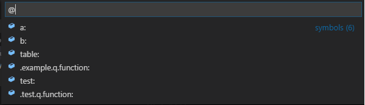

# Q Runner

This is the VSCode Q Runner extension. It gives you some helpful commands that run [KDB/Q](https://en.wikipedia.org/wiki/Q_(programming_language_from_Kx_Systems)) queries.

## Features

Create enriched integrated terminal to run Q

Parse and run multi-line selection in integrated terminal

Show variable / function list of the file

## Release Notes

* 0.1.0 - Initial release.

## Download

* [Visual Studio Code | Marketplace](https://marketplace.visualstudio.com/items?itemName=)
